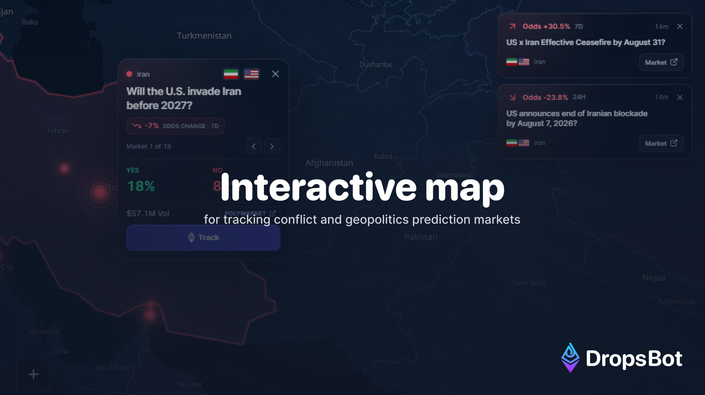

<p align="center">
  <a href="https://oddsfront.com">
    
  </a>
</p>

<h1 align="center">OddsFront</h1>

<p align="center">
  A live, read-only map of conflict and geopolitics prediction markets.
</p>

<p align="center">
  <a href="https://oddsfront.com"><strong>Open the live map</strong></a>
  ·
  <a href="https://github.com/svg8bit/OddsFront/actions/workflows/ci.yml">CI</a>
  ·
  <a href="SECURITY.md">Security</a>
</p>

[](https://github.com/svg8bit/OddsFront/actions/workflows/ci.yml)

OddsFront turns active Polymarket geopolitics markets into a browsable world
map. It automatically discovers qualifying events, places them on reviewed or
country-level anchors, sizes markers by observed volume, and surfaces material
odds moves in a lightweight activity rail.

## Highlights

- Automatic discovery of active conflict, war, peace, and geopolitics markets.
- Deterministic country fallback for new events, backed by 175 Natural Earth
  land anchors.
- Volume-weighted markers, event paging, expiry data, and weekly odds changes.
- Read-only market activity for material odds moves and verified large trades.
- Compact macro and crypto strip with resilient server-side data fallbacks.
- Adaptive rendering: a low-bandwidth SVG map on compact or constrained
  devices, with the detailed WebGL map loaded only when appropriate or asked
  for by the visitor.
- Self-hosted map geometry, fonts, night texture, MapLibre worker, and brand
  assets for predictable rendering.
- No wallet connection, custody, signing, or embedded trading.

## Quick start

Requirements: Node.js 24 and npm 10 or newer.

```bash
git clone https://github.com/svg8bit/OddsFront.git
cd OddsFront
npm ci
npm run dev
```

Open `http://127.0.0.1:3000`. The public-data fallbacks work without local
credentials. Optional server-only integrations are documented in
[`.env.example`](.env.example); copy it to `.env.local` only when you need one
of them.

## Quality checks

```bash
npm run lint
npm run typecheck
npm run build
npx playwright install chromium
npm run test:e2e
```

`npm run check` runs the deterministic lint, type, and production-build gate.
The browser suite uses a fixture route and writes screenshots only to the
ignored `output/` directory.

## Activity rail signals

The right-hand rail is filled from current public Polymarket data and keeps at
most three distinct events visible. Fresh trades have priority, followed by
newly observed odds changes, liquid rolling movers, and 24-hour volume leaders.

- Trades: at least `$5K`, observed during the previous 60 minutes.
- One-hour movers: at least `1.0` percentage point on `$100K` total volume and
  `$5K` 24-hour volume.
- 24-hour movers: at least `3.0` percentage points with the same liquidity
  gates.
- Volume leaders: at least `$1M` total volume and `$25K` 24-hour volume.

Rolling signals expire when the market feed is stale, never use seven-day
changes, and are deduplicated by event before rendering.

## How it works

```text
Browser
  ├── adaptive map UI
  │     ├── Lite: static Natural Earth map and interactive event markers
  │     └── Detailed: lazily loaded MapLibre map
  └── cached read-only Next.js endpoints
        ├── Polymarket public market data
        ├── public market-price fallbacks
        └── optional authenticated server-only feed
```

Secrets are read only inside server modules. No secret is required in the
browser, and variables prefixed with `NEXT_PUBLIC_` are intentionally not used.
See [Architecture](docs/architecture.md), [Data sources](docs/data-sources.md),
and [Deployment](docs/deployment.md) for the full boundary.

## Repository layout

```text
app/                              Next.js routes and read-only APIs
features/global-conflict-map/     map UI, normalization, fixtures, and layers
lib/                              server adapters and validated outbound links
public/                           self-hosted map, font, icon, and brand assets
scripts/                          deterministic asset-generation utilities
tests/                            Playwright interaction and rendering checks
```

## Security and privacy

- Never commit `.env`, `.env.local`, tokens, API keys, or private feed URLs.
- Optional credentials remain server-side and are never serialized to HTML or
  client JavaScript.
- Outbound event and asset links are bounded and validated before rendering.
- GitHub Actions use read-only permissions by default; CodeQL, Dependabot,
  secret scanning, and push protection provide additional repository controls.

Please report vulnerabilities privately as described in
[`SECURITY.md`](SECURITY.md).

## Attribution and terms

OddsFront is an independent analytics interface and is not affiliated with or
endorsed by Polymarket. Market data can be delayed or unavailable and is shown
for informational purposes only, not as financial, legal, or investment advice.

This repository is public for transparency. No license is granted for the
OddsFront or DropsBot brand assets. Third-party datasets, fonts, icons, and
libraries retain their original terms; see
[`THIRD_PARTY_NOTICES.md`](THIRD_PARTY_NOTICES.md).

Contributions are welcome through reviewed pull requests. Start with
[`CONTRIBUTING.md`](CONTRIBUTING.md).
