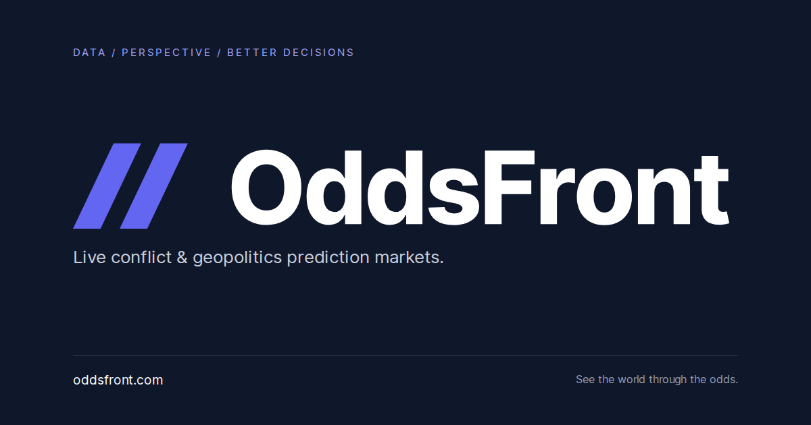

<p align="center">
  <a href="https://oddsfront.com">
    
  </a>
</p>

<h1 align="center">OddsFront</h1>

<p align="center">
  World news with a live, read-only map of geopolitics prediction markets.
</p>

<p align="center">
  <a href="https://oddsfront.com"><strong>Open the live map</strong></a>
  ·
  <a href="https://oddsfront.com/news">Read the news</a>
  ·
  <a href="https://t.me/oddsfront">Telegram EN</a>
  ·
  <a href="https://t.me/oddsfront_ru">Telegram RU</a>
  ·
  <a href="https://github.com/svg8bit/OddsFront/actions/workflows/ci.yml">CI</a>
  ·
  <a href="SECURITY.md">Security</a>
</p>

[](https://github.com/svg8bit/OddsFront/actions/workflows/ci.yml)

OddsFront turns active Polymarket geopolitics markets into a browsable world
map. It automatically discovers qualifying events, places them on reviewed or
country-level anchors, sizes markers by observed volume, and surfaces material
odds moves in a lightweight activity rail.

The [newsroom](https://oddsfront.com/news) publishes source-linked reporting
across strikes, invasions, ceasefires, diplomacy, politics, energy, security
and humanitarian developments. Stories connect to relevant prediction markets
when a verified match is available. Browse by topic, follow the
[English Telegram channel](https://t.me/oddsfront) or
[Russian Telegram channel](https://t.me/oddsfront_ru), or subscribe with a feed
reader to [English RSS](https://oddsfront.com/news/rss.xml) or
[Russian RSS](https://oddsfront.com/ru/news/rss.xml).

## Highlights

- Automatic discovery of active conflict, war, peace, and geopolitics markets.
- Deterministic country fallback for new events, backed by 175 Natural Earth
  land anchors.
- Volume-weighted markers, event paging, expiry data, and weekly odds changes.
- Read-only market activity for material odds moves and verified large trades.
- Compact macro and crypto strip with resilient server-side data fallbacks.
- Self-hosted map geometry, compact Inter font, MapLibre worker, and brand
  assets for predictable rendering.
- No wallet connection, custody, signing, or embedded trading.

## Quick start

Requirements: Node.js 24 and npm 10 or newer.

```bash
git clone https://github.com/svg8bit/OddsFront.git
cd OddsFront
npm ci
npm run dev
```

Open `http://127.0.0.1:3000`. The public-data fallbacks work without local
credentials. Optional server-only integrations are documented in
[`.env.example`](.env.example); copy it to `.env.local` only when you need one
of them.

## Quality checks

```bash
npm run lint
npm run typecheck
npm run build
npx playwright install chromium
npm run test:e2e
```

`npm run check` runs the deterministic lint, type, and production-build gate.
The browser suite uses a fixture route and writes screenshots only to the
ignored `output/` directory.

## Activity rail signals

The right-hand rail uses current public Polymarket data and keeps at most three
distinct events visible. Up to two verified large buys have priority; rolling
odds movers fill the remaining positions.

- Large buys: at least `$200K`, observed in the previous 15 minutes.
- Daily movers: at least 5 percentage points over 24 hours.
- Weekly movers: at least 20 percentage points over seven days.
- Eligible markets require at least `$100K` volume and a future verified deadline.

Rolling cards reflect the latest verified snapshot. Fresh observations renew
their lifetime without replaying their entry animation. Dismissals persist for
the current visit; expired or unavailable data never becomes an invented alert.
The browser checks for updates on entry, tab resume, browser restoration and
reconnection. Failed or older responses preserve the last verified snapshot.

## How it works

```text
Browser
  ├── static map UI and locally hosted basemap assets
  └── cached read-only Next.js endpoints
        ├── Polymarket public market data
        ├── public market-price fallbacks
        └── optional authenticated server-only feed
```

Secrets are read only inside server modules. No secret is required in the
browser, and variables prefixed with `NEXT_PUBLIC_` are intentionally not used.
See [Architecture](docs/architecture.md), [Data sources](docs/data-sources.md),
and [Deployment](docs/deployment.md) for the full boundary.

## Repository layout

```text
app/                              Next.js routes and read-only APIs
features/global-conflict-map/     map UI, normalization, fixtures, and layers
lib/                              server adapters and validated outbound links
public/                           self-hosted map, font, icon, and brand assets
scripts/                          deterministic asset-generation utilities
tests/                            Playwright interaction and rendering checks
```

## Brand identity

The [OddsFront brandbook](assets/brand/oddsfront/oddsfront-brandbook-v1.pdf),
[SVG masters](assets/brand/oddsfront/svg), and
[brand guide](assets/brand/oddsfront/README.md) define the external identity.
Browser icons and link previews use OddsFront. Existing in-page DropsBot
controls and branding are intentionally independent of this identity package.

## Security and privacy

- Never commit `.env`, `.env.local`, tokens, API keys, or private feed URLs.
- Optional credentials remain server-side and are never serialized to HTML or
  client JavaScript.
- Outbound event and asset links are bounded and validated before rendering.
- GitHub Actions use read-only permissions by default; CodeQL, Dependabot,
  secret scanning, and push protection provide additional repository controls.

Please report vulnerabilities privately as described in
[`SECURITY.md`](SECURITY.md).

## Attribution and terms

OddsFront is an independent analytics interface and is not affiliated with or
endorsed by Polymarket. Market data can be delayed or unavailable and is shown
for informational purposes only, not as financial, legal, or investment advice.

This repository is public for transparency. No license is granted for the
OddsFront or DropsBot brand assets. Third-party datasets, fonts, icons, and
libraries retain their original terms; see
[`THIRD_PARTY_NOTICES.md`](THIRD_PARTY_NOTICES.md).

Contributions are welcome through reviewed pull requests. Start with
[`CONTRIBUTING.md`](CONTRIBUTING.md).
